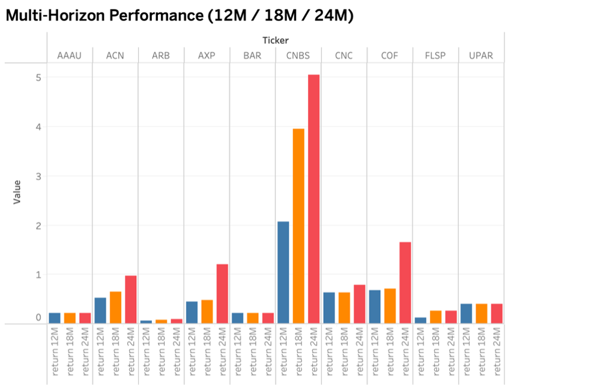
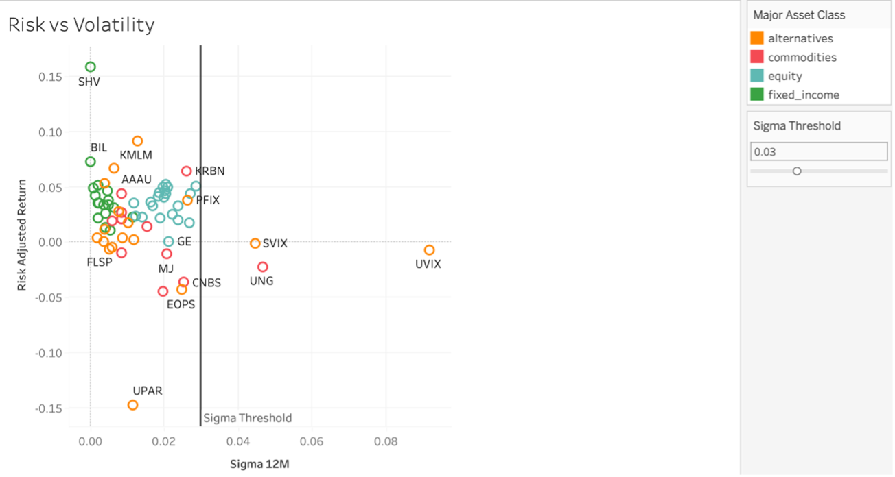
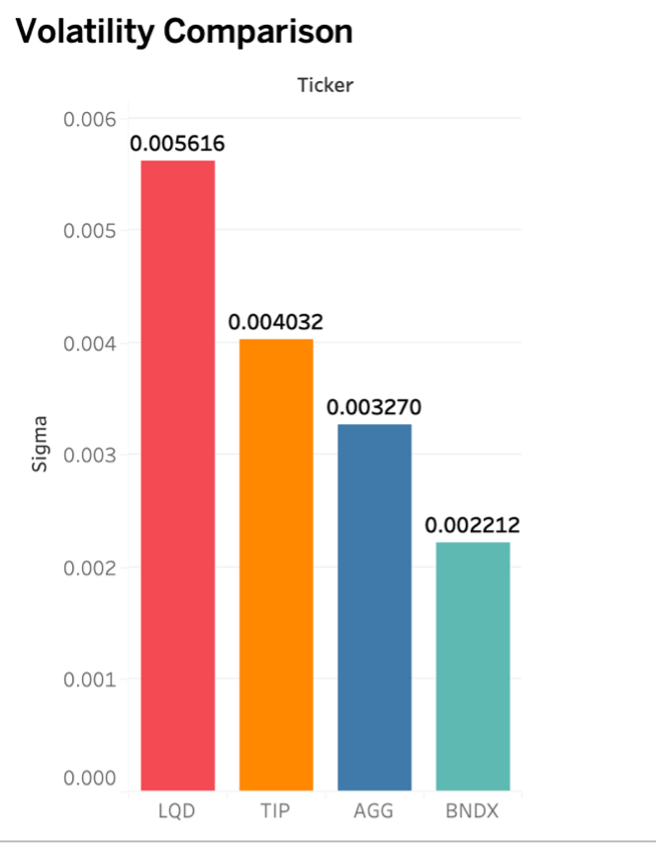
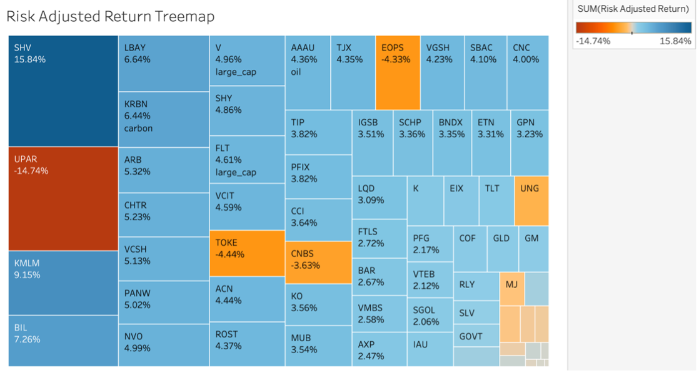

# SQL Portfolio Risk Diagnostics
SQL-Based Financial Risk Engineering Framework (MySQL)

---

## Overview

This project implements a structured portfolio risk diagnostics pipeline using SQL.

Built on a relational MySQL investment schema, the framework evaluates portfolio performance and risk characteristics through:

- Multi-horizon return modeling (12M / 18M / 24M)
- Volatility (sigma) estimation using log-return dispersion
- Average daily return computation
- Risk-adjusted performance metrics
- Asset allocation concentration analysis
- Market-regime aware investment evaluation

The objective is not just performance reporting, but risk interpretation — understanding how return, volatility, and allocation structure interact under macroeconomic stress (e.g., inflationary environments).

---

## System Architecture

MySQL Database  
→ Data Cleaning & View Engineering  
→ Window Functions & Log-Return Modeling  
→ Risk Metrics (Sigma, Risk-Adjusted Returns)  
→ Allocation Diagnostics  
→ Visualization Layer (Tableau)  
→ Strategic Interpretation  

---

## Database Context

The project was built on a structured investment schema containing:

- `account_dim`
- `customer_details`
- `holdings_current`
- `pricing_daily_new`
- `security_masterlist`

A cleaned client-level portfolio view is created to unify holdings, pricing, and asset classification before time-series modeling.

---

## SQL Components

### 1. Client Portfolio View
Creates a normalized portfolio dataset by joining holdings, pricing, and security classification tables.

File:
sql/01_create_client_view.sql

---

### 2. Multi-Horizon Returns Engine
Uses window functions (`LAG`) to compute daily log returns and aggregates them into:

- 12-Month Returns  
- 18-Month Returns  
- 24-Month Returns  

File:
sql/02_multi_horizon_returns.sql

---

### 3. Volatility & Risk Metrics
Computes:

- Sigma (STDDEV of daily log returns)
- Average daily return
- Risk-adjusted return ratio

File:

sql/03_volatility_and_risk_metrics.sql

---

### 4. Asset Allocation Diagnostics
Calculates portfolio exposure by major asset class and allocation percentages.

File:
sql/04_asset_allocation_breakdown.sql

---

## Visualization Layer (Tableau)

SQL outputs were exported and visualized using Tableau to translate quantitative metrics into risk diagnostics dashboards.

The dashboard was designed to:

- Compare multi-horizon performance across securities
- Map volatility (sigma) against average daily returns
- Identify risk-adjusted efficiency outliers
- Evaluate allocation concentration

### Multi-Horizon Performance

### Risk vs Volatility

### Volatility Comparison

### Risk-Adjusted Return Treemap

---

## Strategic Interpretation

The diagnostics framework enables structured portfolio evaluation under changing macro conditions.

Example insights explored:

- Duration sensitivity in bond ETFs during inflationary regimes
- Risk-return tradeoffs between defensive vs growth allocations
- Identification of inefficient high-volatility exposures
- Reallocation logic toward higher risk-adjusted efficiency assets

---

## Technologies

- MySQL
- SQL (CTEs, Window Functions, Aggregation)
- Tableau
- Financial Time-Series Modeling

---

## Project Structure
sql/
results/
report/
README.md

---

## Author

Regina Garfias
